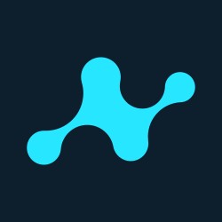

 
 &nbsp;
 &nbsp

&nbsp;

&nbsp;

 

# Nebulai Brand Kit

>This repo contains logos for Nebulai.
>
>Nebulai is a platform where developers and users build, share, and innovate AI agent solutions. 
>

### Logos

| Symbol                                            | Wordmark                                                |
| ------------------------------------------------- | ------------------------------------------------------- |
|    |    |
|  |  |
|  |  |
